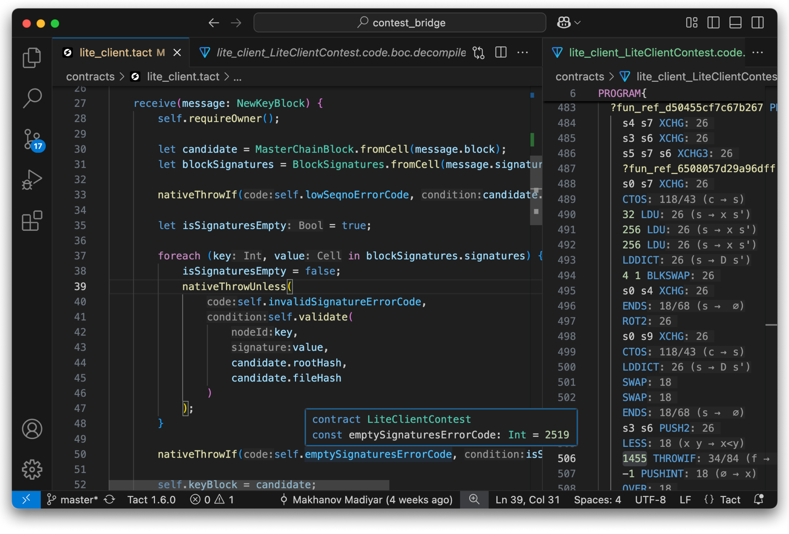

# Tact Language

Developed by [TON Studio](https://tonstudio.io), powered by the community.

**[Features] • [Installation] • [Community] • [Troubleshooting]**

[Features]: #features
[Installation]: #installation
[Community]: #community
[Troubleshooting]: #troubleshooting

---

This extension for VSCode-based editors provides support for the [Tact programming language](https://tact-lang.org).
Tact is a next-generation programming language for building secure, scalable, and maintainable smart contracts on TON
blockchain.

## Features

- [Semantic syntax highlighting]
- [Code completion] with [auto import], [postfix completion], snippets, [imports completion]
- Go to [definition], implementation, [type definition]
- Find all references, workspace symbol search, symbol renaming, [type-based search]
- Types and documentation on hover
- Inlay hints [for types], [parameter names] and [more]
- On-the-fly [inspections] with quick fixes
- Signature help inside calls, `initOf` and struct initialization
- [Lenses] with implementation/reference counts
- [Gas estimates] for assembly functions
- Build and test projects based on [Blueprint] and [Tact template]
- Integration with [Tact compiler] and [Misti] static analyzer
- Formatting

[Semantic syntax highlighting]: https://github.com/tact-lang/tact-language-server/blob/master/docs/manual/features/highlighting.md
[Code completion]: https://github.com/tact-lang/tact-language-server/blob/master/docs/manual/features/completion.md
[auto import]: https://github.com/tact-lang/tact-language-server/blob/master/docs/manual/features/completion.md#auto-import
[postfix completion]: https://github.com/tact-lang/tact-language-server/blob/master/docs/manual/features/completion.md#postfix-completion
[imports completion]: https://github.com/tact-lang/tact-language-server/blob/master/docs/manual/features/completion.md#imports-completion
[definition]: https://github.com/tact-lang/tact-language-server/blob/master/docs/manual/features/navigation.md#go-to-definition
[type definition]: https://github.com/tact-lang/tact-language-server/blob/master/docs/manual/features/navigation.md#go-to-type-definition
[for types]: https://github.com/tact-lang/tact-language-server/blob/master/docs/manual/features/inlay-hints.md#type-hints
[parameter names]: https://github.com/tact-lang/tact-language-server/blob/master/docs/manual/features/inlay-hints.md#parameter-hints
[more]: https://github.com/tact-lang/tact-language-server/blob/master/docs/manual/features/inlay-hints.md#additional-hints
[inspections]: https://github.com/tact-lang/tact-language-server/blob/master/docs/manual/features/inspections.md
[Lenses]: https://github.com/tact-lang/tact-language-server/blob/master/docs/manual/features/code-lenses.md
[Gas estimates]: https://github.com/tact-lang/tact-language-server/blob/master/docs/manual/features/gas-calculation.md
[Blueprint]: https://docs.ton.org/v3/documentation/smart-contracts/getting-started/javascript
[Tact template]: https://github.com/tact-lang/tact-template
[Tact compiler]: https://github.com/tact-lang/tact
[Misti]: https://nowarp.io/tools/misti/
[type-based search]: https://github.com/tact-lang/tact-language-server/blob/master/docs/manual/features/type-based-search.md

## Quick start

The easiest way to get started with Tact is in VS Code or editors based on it:

1. Install the Tact language extension
   [in VS Code](https://marketplace.visualstudio.com/items?itemName=tonstudio.vscode-tact)
   or [in VS Code-based editors](https://open-vsx.org/extension/tonstudio/vscode-tact)
2. Reload VS Code
3. That's it!

## Installation

### VS Code / VSCodium / Cursor / Windsurf

1. Get the latest `.vsix` file from [releases](https://github.com/tact-lang/tact-language-server/releases) from
   [VS Code marketplace](https://marketplace.visualstudio.com/items?itemName=tonstudio.vscode-tact)
   or from [Open VSX Registry](https://open-vsx.org/extension/tonstudio/vscode-tact)
2. In VS Code:
    - Open the Command Palette (`Ctrl+Shift+P` or `Cmd+Shift+P`)
    - Type "Install from VSIX"
    - Select the downloaded `.vsix` file
    - Reload VS Code

If you use Cursor, Windsurf, or any other AI-powered editor, you can feed it the following content,
specifically created for LLMs:

- https://docs.tact-lang.org/llms-full.txt — for full context
- https://docs.tact-lang.org/llms-small.txt — for smaller context windows

## Community

- [`@tactlang` on Telegram](https://t.me/tactlang) - Main community chat and discussion group.
- [`@tactlang_ru` on Telegram](https://t.me/tactlang_ru) _(Russian)_
- [`@tact_kitchen` on Telegram](https://t.me/tact_kitchen) - Channel with updates from the team.
- [`@tact_language` on X/Twitter](https://x.com/tact_language)
- [`tact-lang` organization on GitHub](https://github.com/tact-lang)
- [`@ton_studio` on Telegram](https://t.me/ton_studio)
- [`@thetonstudio` on X/Twitter](https://x.com/thetonstudio)

## Troubleshooting

See [TROUBLESHOOTING.md](docs/manual/troubleshooting.md).

# License

MIT
